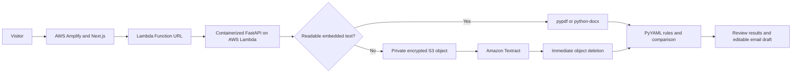

# Coverage Clarity

**A decision-support prototype for commercial insurance intake, COI review, and evidence comparison.**

Certificate & Coverage Clarity is an independent portfolio project built with mock business scenarios and sample insurance documents. It does not use employer data, client data, proprietary workflows, carrier-confidential information, or internal company tools.

**Live AWS demonstration:** [main.d2cm8nx2fbbm4a.amplifyapp.com](https://main.d2cm8nx2fbbm4a.amplifyapp.com/)

The project demonstrates how AI-assisted review can support commercial insurance, compliance, and service workflows without replacing professional judgment. It organizes requirements, compares evidence, highlights gaps, and drafts review-ready follow-up language.

## Overview

Coverage Clarity explores how AI-assisted workflows can reduce friction in commercial insurance intake by helping users organize business context, map responses to carrier-facing questions, identify uncertainty, and preserve review checkpoints.

The application supports commercial insurance professionals working through contracts, Certificates of Insurance (COIs), policies, and endorsement evidence. It turns insurance requirements into structured review items, compares those requirements against uploaded evidence, and drafts a human-review email request for the insured's broker, insurance agent, or carrier representative.

The goal is not to replace professional judgment. The goal is to make fragmented, review-heavy information easier to inspect, document, and hand off.

## Business Problem

Commercial insurance review often requires a person to compare a contract, Certificate of Insurance, policy excerpts, endorsements, and email notes. The work is detail-heavy and easy to slow down:

- Business information may arrive through contracts, COIs, policies, emails, notes, or endorsement evidence.
- Contract requirements may be spread across multiple paragraphs.
- COIs may show limits but not prove endorsement wording.
- Additional insured and waiver of subrogation wording often needs review beyond the certificate.
- Missing information can delay handoffs between producers, CSRs, account managers, brokers, and carriers.
- Reviewers need a clear audit trail showing what was found, what was not found, and what still needs human confirmation.

Coverage Clarity is designed around that operational reality: the work is not simply extract text. The work is organizing uncertainty so a reviewer can make a clearer decision.

## Decision-Support Approach

Coverage Clarity converts document text into structured review outputs:

1. Intake contracts, COIs, policies, endorsement evidence, or notes.
2. Extract insurance requirements and evidence signals.
3. Compare required coverage against available evidence.
4. Flag missing, unmet, unclear, or review-needed items.
5. Generate a broker/agent/carrier email draft requesting corrected evidence.
6. Keep final decisions human-reviewed and auditable.

## What This Demonstrates

- Applied AI workflow design for regulated or review-heavy operations
- Commercial insurance process understanding
- Deterministic rules for insurance requirement checks
- Structured extraction and comparison logic
- Source-aware outputs with explanation text
- Human-in-the-loop review boundaries
- Governance-aware AI implementation
- FastAPI backend design with upload and JSON endpoints
- Portfolio-ready documentation, samples, deployment notes, and test coverage

## Deployed AWS Architecture



The frontend is deployed through AWS Amplify. The FastAPI backend runs as a container image in AWS Lambda using the AWS Lambda Web Adapter. GitHub Actions builds the image, publishes it to Amazon ECR, and updates the Lambda function. CloudFormation manages the private temporary S3 bucket and least-privilege Textract permissions.

Image-based PDFs are stored only while Textract processes them. The application requests immediate deletion after processing, and a one-day S3 lifecycle rule provides backup cleanup. The public demonstration has no sign-in, so visitors are instructed to use public samples or de-identified documents only.

## Technology Stack

- **Frontend:** Next.js, React, TypeScript, AWS Amplify
- **API:** FastAPI, Python, AWS Lambda, AWS Lambda Web Adapter
- **Document processing:** pypdf, python-docx, Amazon Textract
- **Rules and governance:** PyYAML, deterministic comparison logic, explicit human-review controls
- **AWS infrastructure:** Amazon ECR, Amazon S3, AWS CloudFormation, CloudWatch
- **Delivery and testing:** GitHub Actions, Docker, pytest, ESLint, Next.js production builds

## Verified Deployment Results

- 16 backend tests passing
- Next.js production build and lint checks passing
- Public sample comparison returns 94% document-reading confidence
- Public sample correctly identifies General Liability, Additional Insured, Umbrella, and Certificate Holder evidence
- Public sample correctly flags Waiver of Subrogation as missing
- Human-review email draft generated successfully
- Measured live response time: 5.86 seconds cold and 0.33 seconds warm

Document-reading confidence measures how confidently the system read the uploaded files. It does not represent whether the coverage satisfies the requester requirements.

## System Architecture

```mermaid
flowchart LR
    A["Contract, COI, policy, endorsement, or notes"] --> B["Input Layer"]
    B --> C["Extraction Layer"]
    C --> D["Obligation Modeling"]
    D --> E["Validation Layer"]
    E --> F["Comparison Layer"]
    F --> G["Decision Support"]
    G --> H["Governance Checks"]
    H --> I["Structured Review Output"]
    I --> J["Email Draft + Human Review"]
```



## RECKON-Aligned Architecture

Coverage Clarity's backend follows the RECKON framework used across the AI orchestration portfolio:

- **R - Request**: `input_layer/intake.py` builds initial state from the incoming request.
- **E - Extraction**: `extraction_layer/insurance_parser.py` parses contracts, COIs, and policies.
- **C - Context**: `obligation_modeling/modeler.py` builds structured obligations from extracted content.
- **K - Knowledge**: `governance/constraints.py` and `rules/*.yaml` apply domain rules and refusal logic.
- **O - Orchestration**: `state_engine/engine.py` assigns state across the review pipeline.
- **N - Next Best Action**: `decision_support/advisor.py` generates explanations and recommended next steps per item.

## Current Checks

- General Liability limits
- Umbrella / Excess limits
- Additional Insured parties and endorsement signals
- Waiver of Subrogation parties and endorsement signals
- Certificate Holder and additional coverage notes
- Management liability lines, including D&O, EPLI, Fiduciary, Crime/Fidelity, and Cyber Liability
- Cyber / Tech E&O components, including privacy, network security, breach response, PCI/payment card, media liability, ransomware/extortion, dependent business interruption, computer fraud, social engineering, and regulatory defense signals

## Sample Scenario

Sample contract requirement:

```text
Contractor must provide Commercial General Liability with $1,000,000 each occurrence and
$2,000,000 aggregate. Owner and property manager must be named as Additional Insured on
a primary and noncontributory basis. Waiver of Subrogation is required where permitted by law.
```

Sample evidence:

```text
Certificate shows General Liability $1,000,000 each occurrence / $2,000,000 aggregate.
Description box references Additional Insured, but no endorsement form is attached.
Waiver of Subrogation is not shown.
```

Sample output:

```json
{
  "analysis_mode": "comparison",
  "overall_confidence": 0.94,
  "items": [
    {
      "obligation_type": "General Liability",
      "state": "met",
      "explanation": "Contract requirement is supported by uploaded COI or policy evidence.",
      "next_action": "No immediate action needed."
    },
    {
      "obligation_type": "Additional Insured",
      "state": "unmet",
      "explanation": "Certificate wording references AI, but supporting endorsement evidence is not confirmed.",
      "next_action": "Request the matching endorsement or corrected certificate. Human review required before carrier-facing use."
    },
    {
      "obligation_type": "Waiver of Subrogation",
      "state": "missing",
      "explanation": "The contract requires this item, but no matching COI or policy evidence was found.",
      "next_action": "Request supporting COI or policy evidence. Human review required before carrier-facing use."
    }
  ],
  "email_draft": {
    "subject": "Request for revised COI and supporting endorsements",
    "requires_human_review": true
  }
}
```

## Repository Structure

```text
app/                         Next.js portfolio demo shell
backend/app/                 FastAPI backend application
backend/app/api/             API route definitions
backend/app/comparison_layer Evidence comparison logic
backend/app/extraction_layer Document parsing and extraction
backend/app/governance       Human-review and output constraints
backend/app/obligation_modeling Requirement modeling logic
backend/app/rules            YAML rule configuration
backend/tests/               Backend unit tests
docs/                        AWS, frontend API, governance, and publishing notes
samples/                     Synthetic input and output examples
```

## Run Locally

Backend:

```powershell
cd backend
python -m venv .venv
.\.venv\Scripts\Activate.ps1
pip install -r requirements.txt
uvicorn app.main:app --reload --host 127.0.0.1 --port 8010
```

Frontend:

```powershell
npm install
npm run dev
```

API health check:

```text
GET http://127.0.0.1:8010/health
```

Review endpoint:

```text
POST http://127.0.0.1:8010/api/coi-review
```

Upload endpoint:

```text
POST http://127.0.0.1:8010/api/coi-review-upload
```

## Testing

```powershell
cd backend
pytest
```

## Deployment

- Live frontend: `https://main.d2cm8nx2fbbm4a.amplifyapp.com/`
- Lambda container definition: `backend/Dockerfile.lambda`
- GitHub Actions deployment: `.github/workflows/deploy-lambda-backend.yml`
- CloudFormation resources: `infrastructure/textract-resources.yaml`
- AWS implementation notes: `docs/AWS_LEAPSTACKS_LAUNCH.md`

## Governance Model

Coverage Clarity follows a layered governance model based on separation of responsibility:

- Generative reasoning drafts explanations and review language.
- Application logic controls validation, thresholds, routing, refusal, and state management.
- Deterministic rules handle requirement checks and evidence comparison.
- Source grounding supports review and auditability.
- Humans retain final accountability for carrier-facing or coverage-related decisions.

See `docs/governance_model.md` for the full governance model.

## Human Review Boundary

Coverage Clarity does not silently autofill forms, certify compliance, confirm coverage, bind insurance, or replace an insurance professional.

The goal is not to automate judgment away. The goal is to reduce cognitive load, surface uncertainty, and give reviewers a clearer packet of information to evaluate.

Coverage Clarity is decision support only. It does not provide legal or insurance advice. All outputs require review by a qualified human before use.

## Suggested Portfolio Framing

This project is part of a broader portfolio focused on decision-support systems for operational teams working inside complex, regulated, or high-friction workflows.

## Future Improvements

- Add field-level source citations in the UI
- Add reviewer approve/reject controls and audit export
- Add more synthetic sample packets for contractor, restaurant, landlord, and technology services risks
- Add confidence scoring by requirement category
- Add downloadable review packets for handoff to account teams
- Add a starter checklist mode for users who do not yet have a contract or COI to upload
